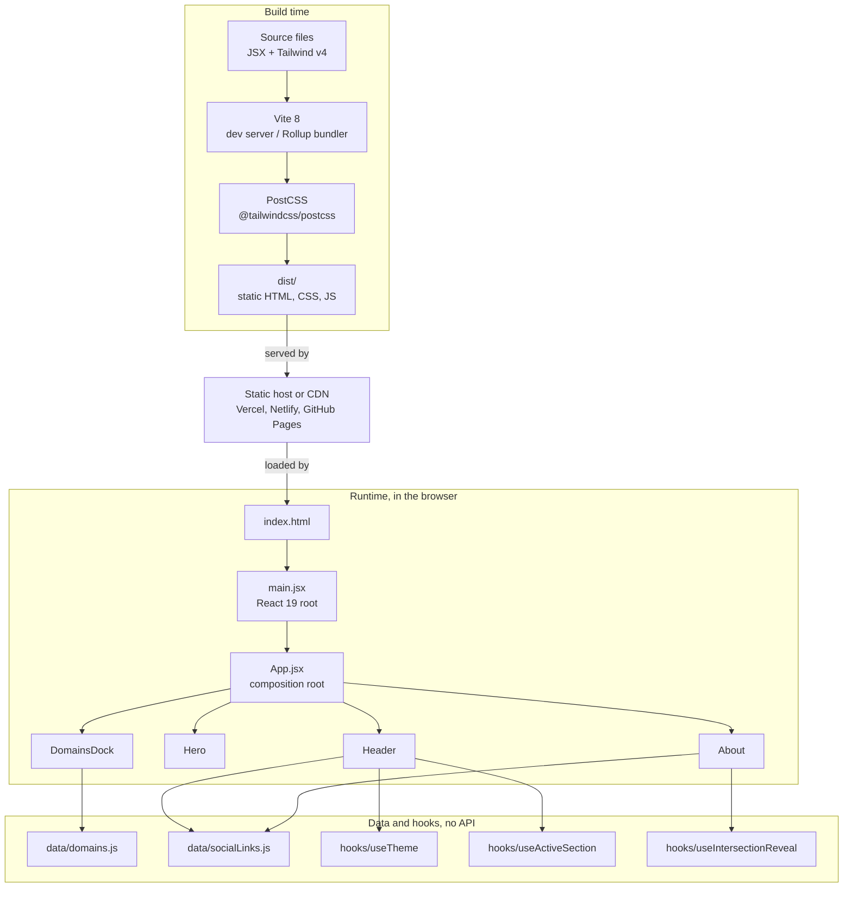

<p align="center">
  
</p>

<h1 align="center">ferion</h1>

<p align="center">
  Most portfolios are just a list of skills and a contact form. This one actually tells a story.
</p>

<p align="center">
  <a href="https://react.dev"></a>
  <a href="https://vitejs.dev"></a>
  <a href="https://tailwindcss.com"></a>
  <a href="LICENSE"></a>
  <a href="https://github.com/spacesdrive/ferion/pulls"></a>
</p>

<p align="center">
  <a href="#overview">Overview</a> &middot;
  <a href="#features">Features</a> &middot;
  <a href="#architecture">Architecture</a> &middot;
  <a href="#getting-started">Getting Started</a> &middot;
  <a href="#customization">Customization</a> &middot;
  <a href="#contributing">Contributing</a>
</p>

---

## Overview

Most portfolio templates assume you do one thing. A developer template. A designer template. A photographer template. ferion was built for the opposite case: someone whose interests genuinely span technology, gaming, psychology, content creation, sports, language, and entertainment, and who got tired of pretending that fits in one bullet list.

There is no backend, no API, and no database here. ferion is a single-page React application that compiles to static HTML, CSS, and JavaScript. It runs entirely in the browser, persists exactly one piece of state (your light or dark theme preference, in `localStorage`), and can be hosted anywhere that serves static files.

> "Everyone around me had a plan. I couldn't do it. Not because I was lazy. The opposite, actually. I wanted to do everything."
> from the About section of the live site

If that resonates, this project is a reasonable starting point for your own version of it.

## Features

| Feature | Description |
|---|---|
| Dark and light mode | Theme preference toggles instantly and persists across reloads via `localStorage`. |
| Magnifying domain dock | A macOS-style dock, fixed to the bottom of the viewport, with cosine-based icon magnification on hover and click-through to each domain's link. |
| Hover-reactive hero headline | A canvas-based sparkle and beam effect wraps a key word in the headline on hover, with no third-party particle library required. |
| Scroll-spy navigation | The active nav tab tracks whichever section is currently in view as you scroll. |
| Animated connect card | An About-section profile card that expands on hover to reveal social links with a layout transition. |
| Responsive by default | Mobile gets a slide-in sheet menu, a touch-safe dock with `env(safe-area-inset-bottom)` padding, and fluid type scales down to 320px wide screens. |
| Feature-based structure | Components, hooks, and data are organized by responsibility, not by component library, so the codebase stays easy to navigate as it grows. |

## Architecture

ferion has no runtime backend. "Architecture" here means the build pipeline that turns source files into a static bundle, and the component tree that bundle renders in the browser.



## Tech Stack

| Tool | Role |
|---|---|
| [React 19](https://react.dev) | UI library |
| [Vite 8](https://vitejs.dev) | Dev server and production bundler |
| [Tailwind CSS v4](https://tailwindcss.com) | Utility-first styling, configured via CSS rather than a JS config file |
| [shadcn](https://ui.shadcn.com) | Source for the Button, Card, and Sheet primitives |
| [ForgeUI](https://forgeui.in) | Source for the nav tabs, hero text shimmer, and About connect card, vendored and adapted |
| [21st.dev community](https://21st.dev/community/components/dhmnpunit/mac-os-dock/default) | Source pattern for the magnifying macOS-style dock |
| [Aceternity UI](https://ui.aceternity.com) | Source pattern for the hero's hover Cover effect |
| [motion](https://motion.dev) | Animation library powering the dock, cover effect, and nav transitions |
| [lucide-react](https://lucide.dev) | Icon set used throughout the UI |
| [react-icons](https://react-icons.github.io/react-icons) | Icons used by the vendored ForgeUI components |
| [Geist](https://vercel.com/font) | Variable typeface, loaded via `@fontsource-variable/geist` |

## Getting Started

### Prerequisites

- Node.js 18 or later
- npm 9 or later, or pnpm or yarn

### Installation

```bash
git clone https://github.com/spacesdrive/ferion.git
cd ferion/ferion
npm install
```

### Development

```bash
npm run dev       # start the dev server with HMR at localhost:5173
npm run build     # production build, output to dist/
npm run preview   # preview the production build locally
npm run lint      # run ESLint checks
```

Open [http://localhost:5173](http://localhost:5173) once the dev server is running.

## Project Structure

```
ferion/
├── ferion/                    # the actual application
│   ├── favicon.png
│   ├── src/
│   │   ├── components/
│   │   │   ├── ui/            # shadcn primitives: button, card, sheet, sparkles
│   │   │   ├── forgeui/       # vendored ForgeUI: text-shimmer, social-card, animated-tabs
│   │   │   ├── dock/          # MacOSDock, the magnifying domain dock
│   │   │   ├── cover/         # Cover, the hero's hover sparkle effect
│   │   │   ├── layout/        # Header, ThemeToggle, SocialLinks, DomainsDock
│   │   │   └── sections/      # Hero, About
│   │   ├── data/               # domains.js, socialLinks.js
│   │   ├── hooks/               # useTheme, useActiveSection, useIntersectionReveal
│   │   ├── lib/                  # utils.js, the cn() class merge helper
│   │   ├── App.jsx                # composition root
│   │   ├── main.jsx                # React root entry
│   │   └── index.css                # Tailwind import and theme tokens
│   ├── index.html
│   ├── jsconfig.json           # "@/*" path alias
│   ├── components.json         # shadcn config, including the ForgeUI registry
│   ├── vite.config.js
│   ├── postcss.config.cjs
│   └── package.json
└── README.md
```

## Customization

Everything you would want to change to make this your own lives in one of a few predictable places.

| What to change | Where to find it |
|---|---|
| Social links (Reddit, LinkedIn, Hacker News) | `ferion/src/data/socialLinks.js` |
| Domains shown in the dock | `ferion/src/data/domains.js` |
| About me text | `ferion/src/components/sections/About.jsx` |
| Hero copy | `ferion/src/components/sections/Hero.jsx` |
| Nav items | `navItems` in `ferion/src/components/layout/Header.jsx` |
| Accent color, default `#ff0055` | `--primary` in `ferion/src/index.css` |
| Fonts | `@import "@fontsource-variable/geist"` in `ferion/src/index.css` |
| Site title and favicon | `<title>` and the icon link in `ferion/index.html` |

Each domain entry in `domains.js` accepts a `link` field. Leave it as `#` to show "Coming soon" in the dock's click handler, or set it to a real URL to make that icon open in a new tab.

## Deployment

The `dist/` folder produced by `npm run build` is a complete static site with no server-side requirements. Deploy it anywhere that serves static files.

- **Vercel**: import the repo, set the root directory to `ferion`, and it auto-detects Vite.
- **Netlify**: base directory `ferion`, build command `npm run build`, publish directory `dist`.
- **GitHub Pages**: build locally or in a workflow, then publish the `ferion/dist` directory to the `gh-pages` branch.

## Credits

Several UI pieces were adapted from open-source component registries rather than written from scratch, and they are credited here and in code comments at the top of each file:

- [shadcn](https://ui.shadcn.com) for the Button, Card, and Sheet primitives.
- [ForgeUI](https://forgeui.in) for the animated nav tabs, hero text shimmer, and About connect card.
- [21st.dev](https://21st.dev/community/components/dhmnpunit/mac-os-dock/default), specifically the macOS Dock component by dhmnpunit, as the basis for the domain dock.
- [Aceternity UI](https://ui.aceternity.com) for the Cover hover effect pattern used in the hero headline.

Every adapted component was converted from TypeScript to JavaScript, stripped of framework-specific code that does not apply to a Vite app, and in some cases rewritten to avoid pulling in a heavy dependency for a small visual effect. See the comment block at the top of each file under `src/components/forgeui`, `src/components/dock`, and `src/components/cover` for the specifics.

## Contributing

Contributions are welcome, whether that means fixing a bug, improving accessibility, or adding a feature that makes sense for a portfolio like this.

```bash
git clone https://github.com/spacesdrive/ferion.git
cd ferion/ferion
git checkout -b feat/your-feature-name

# make your changes, then stage and commit them
git add .
git commit -m "feat: add scroll progress indicator"

git push origin feat/your-feature-name
```

Then open a pull request against `main`.

Before submitting:

- Run `npm run lint` and resolve any warnings.
- Test in both light and dark mode.
- Test on a mobile viewport, the dock and nav both have mobile-specific behavior.
- Keep pull requests focused on one change at a time.

## Code of Conduct

This project follows the [Contributor Covenant](https://www.contributor-covenant.org/version/2/1/code_of_conduct/). Be respectful, be constructive, and assume good faith.

## License

Released under the [MIT License](LICENSE).

Copyright (c) 2026 Ujjwal Kumar Rai.

## Contact

- Bug reports and feature requests: [open a GitHub issue](https://github.com/spacesdrive/ferion/issues).
- Connect with the author: [LinkedIn](https://www.linkedin.com/in/u-k-r/), [Reddit](https://www.reddit.com/user/mrujjwalkr/), or [Hacker News](https://news.ycombinator.com/user?id=valzor).
